# SharpDotNUT Logo

本文档中英并列：每个小节先英文、后中文。 / Bilingual README: every section is English first,
then Chinese.


<br />


## Animated logo / 动画标志


<br />




The `_B` files paint an opaque white layer behind the artwork and `_BR` adds a `rx="100"` corner
to it — one design unit, the same as the bar thickness and the padding; the others are transparent.

`_B` 文件在画面背后铺一层不透明白底，`_BR` 再给它加一个 `rx="100"` 圆角——一个设计单位，与色条厚度、
留白同值；其余文件透明。

## Install / 安装

```bash
npm install @sharpdotnut/logo     # or: pnpm add @sharpdotnut/logo / bun add @sharpdotnut/logo
```

The package ships the 12 SVGs, the `<logo-anim>` web component and a small PNG rasterizer module. It
has no runtime dependency: `sharp` is only needed if you want the PNGs.

包内含 12 个 SVG、`<logo-anim>` 网页组件与一个很小的 PNG 光栅化模块。没有运行时依赖：只有需要 PNG 时
才用得上 `sharp`。

## Assets / 资源

SVGs resolve by name — through a bundler, or the file directly:

SVG 可按名字解析——走打包器，或直接用文件：

```js
import logoUrl from "@sharpdotnut/logo/Logo.svg"; // bundlers: Vite, webpack, esbuild…
// or read it straight from the package / 或直接从包里读：
// node_modules/@sharpdotnut/logo/dist/Logo_BR.svg
```

PNGs are not shipped. Generate them from the bundled SVGs in a script you own; `sharp` is optional,
so it belongs in your build's devDependencies rather than in this package's dependencies:

PNG 不随包发布。用一个属于你的脚本，从包内自带的 SVG 生成；`sharp` 是可选的，所以它属于你构建流程的
devDependencies，而不是本包的依赖：

```js
// build-logo-pngs.mjs — run once, or wire it into a prebuild step
import { writePngs } from "@sharpdotnut/logo/rasterize.js";

await writePngs("./public/brand"); // the 6 static PNGs / 6 个静态 PNG
```

```bash
npm install --save-dev sharp   # only needed for the PNGs / 只为 PNG 才需要
cp node_modules/@sharpdotnut/logo/dist/*.svg ./public/brand/   # if your build must not read node_modules / 若构建不该读 node_modules
```

## Web Component

`logo-anim.js` loads an animated SVG into a shadow root and is the only way to control the
animation from the page — an animated SVG in an `` is a separate document that page CSS
cannot reach.

`logo-anim.js` 把动画 SVG 载入 shadow root，是页面里唯一能控制这条动画的方式——`` 里的动画 SVG
是独立文档，页面 CSS 够不着。

```html
<script type="module">
  import "@sharpdotnut/logo"; // registers <logo-anim> / 注册 <logo-anim>
  import animated from "@sharpdotnut/logo/Logo_Animated_Full.svg";

  const logo = document.querySelector("logo-anim");
  logo.src = animated; // or point src at a copied file / 或指向拷贝出来的文件
  logo.speed = 2; // twice as fast, applied live / 两倍速，立即生效
  logo.paused = true; // freeze on the current frame / 冻结在当前帧
  logo.replay(); // back to the first frame / 回到第一帧
</script>

<logo-anim alt="SharpDotNUT" style="width: 210px"></logo-anim>
```

| Attribute | Behaviour / 行为 |
| --------- | ---------------- |
| `src`     | animated SVG to load — `_B` / `_BR` for the white layer, square or rounded — resolved with `fetch` (same origin or CORS) <br /> 要加载的动画 SVG——白底用 `_B` / `_BR`，方角或圆角——通过 `fetch` 加载（同源或 CORS） |
| `speed`   | positive multiplier on the SVG's own duration, default `1`; invalid values fall back to `1` <br /> SVG 自身时长的正数倍率，默认 `1`；非法值回退为 `1` |
| `paused`  | freeze on the current frame <br /> 冻结在当前帧 |
| `alt`     | accessible name; without it the element is hidden from assistive tech <br /> 无障碍名称；不设时元素对辅助技术隐藏 |

Methods: `play()`, `pause()`, `replay()`. Properties `speed` and `paused` mirror the attributes.

方法：`play()`、`pause()`、`replay()`。属性 `speed`、`paused` 与同名 attribute 镜像。

The variant is chosen with `src`: the `_B` and `_BR` files already carry the white layer, so
`<logo-anim src="./dist/Logo_Animated_BR.svg">` needs nothing else.

变体由 `src` 决定：`_B`、`_BR` 文件自带白底，所以 `<logo-anim src="./dist/Logo_Animated_BR.svg">`
不需要别的东西。

The shadow root holds `svg { width: 100% }`, so size the element itself with CSS; unset, it takes
the SVG's intrinsic width (700px or 2100px). The duration is read from the SVG with
`getComputedStyle` (`2s` icon, `4s` full logo) and `speed` scales the whole timeline, because every
keyframe is a percentage. `prefers-reduced-motion: reduce` holds the finished logo instead of
playing.

shadow root 里是 `svg { width: 100% }`，所以用 CSS 给元素本体定尺寸；不设时取 SVG 的固有宽度
（700px 或 2100px）。时长由 `getComputedStyle` 从 SVG 里读回（图标 `2s`、完整标志 `4s`），`speed`
缩放整条时间线——因为每个关键帧都是百分比。`prefers-reduced-motion: reduce` 时停在完成态而不播放。

## Regenerating the assets / 重新生成产物

Inside this repository the artwork is the source: `logo.ts` holds the paths and the SVG builders,
`generate.ts` writes all 12 artifacts (plus the PNGs when `sharp` is installed).

在本仓库里，图稿才是源：`logo.ts` 存放路径与 SVG 构建函数，`generate.ts` 写出 12 个产物（装了
`sharp` 时还包括 PNG）。

```bash
pnpm install                # sharp, the only build dependency / 唯一构建依赖
node generate.ts            # rewrites ./dist
```

## License / 许可

The logo may be used, displayed, referenced and shared as-is — including commercially — without
attribution. It may not be modified, recoloured,
distorted, split or combined with other elements, used to imply endorsement, used in misleading or
unlawful content, or registered as a trademark, domain or account. Full terms: [`LICENSE`](./LICENSE).

Logo 可以按原样使用、展示、引用、分享（含商业用途），无需署名。不得修改、变色、变形、
拆分或与其他元素组合，不得暗示背书，不得用于误导或违法内容，不得注册为商标、域名或账号。完整条款见
[`LICENSE`](./LICENSE)。
